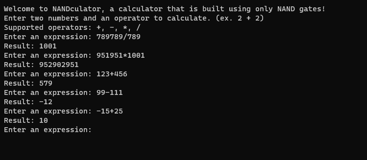

# NANDculator

NANDculator is a calculator that performs arithmetic operations using only a series of NAND gates. NAND gates are also known as universal gates, which means that any other logic gate can be constructed using only NAND gates.

A NAND gate can be defined like this:
`!(A && B)`

Other logic gates can be constructed using only NAND gates, such as AND, OR, NOT, XOR, etc.
For example an XOR gate can be constructed using only NAND gates like this:
`NAND(NAND(A, NAND(A, B)), NAND(B, NAND(A, B)))`

These logic gates can then be used to implement half-adder and full-adder circuits, which can then be used to implement arithmetic operations such as addition, subtraction, multiplication, and division.

Check out these files to see how the logic gates and arithmetic operations are implemented:

- [src/logic/boolean.cpp](src/logic/boolean.cpp) - boolean logic
- [src/logic/bitvector.cpp](src/logic/bitvector.cpp) - bitvector logic
- [src/arithmetic/arithmetic.cpp](src/arithmetic/arithmetic.cpp) - bitvector arithmetic

Screenshot:

